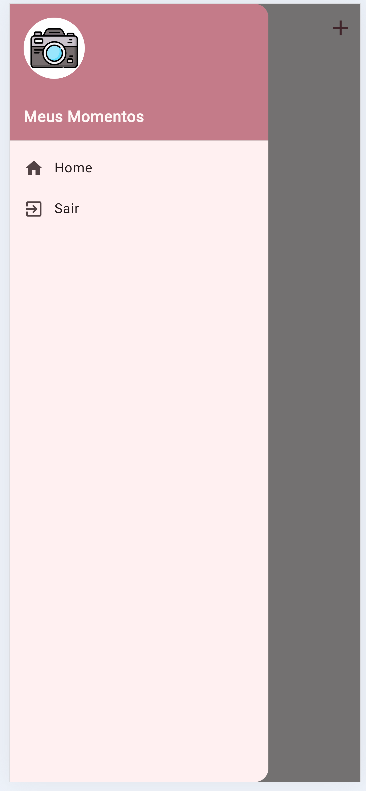

# 📸 Meus Momentos (Foto-flutter)

Aplicativo em **Flutter** para guardar, organizar e compartilhar seus momentos favoritos em fotos — direto do dispositivo, sem depender de conexão com a internet.

> Repositório: [julianopls/Foto-flutter](https://github.com/julianopls/Foto-flutter)

## ✨ Funcionalidades

- 📷 **Captura e seleção de fotos** direto da câmera ou da galeria do dispositivo
- 💾 **Armazenamento local** dos momentos, sem necessidade de backend
- 🕒 **Datas formatadas** para cada momento registrado
- 🔗 **Compartilhamento rápido** das fotos com outros aplicativos
- ⚙️ **Preferências persistentes** do usuário entre sessões
- 📱 Suporte multiplataforma: **Android, iOS, Web, Windows, macOS e Linux**

## 📱 Capturas de tela

| Início | Menu | Menu (variação) |
|---|---|---|
|  |  |  |

| Home | Modal | Lista vazia |
|---|---|---|
|  |  |  |

## 🛠️ Tecnologias e pacotes utilizados

| Pacote | Finalidade |
|---|---|
| [`image_picker`](https://pub.dev/packages/image_picker) | Selecionar/capturar fotos da câmera ou galeria |
| [`path_provider`](https://pub.dev/packages/path_provider) | Acesso a diretórios do sistema para salvar arquivos |
| [`shared_preferences`](https://pub.dev/packages/shared_preferences) | Persistência de dados simples no dispositivo |
| [`intl`](https://pub.dev/packages/intl) | Formatação de datas e internacionalização |
| [`share_plus`](https://pub.dev/packages/share_plus) | Compartilhamento de conteúdo com outros apps |
| [`cupertino_icons`](https://pub.dev/packages/cupertino_icons) | Ícones no estilo iOS |

## 📋 Pré-requisitos

Antes de começar, você precisa ter instalado:

- [Flutter SDK](https://docs.flutter.dev/get-started/install) (`^3.12.1` ou compatível com o Dart definido no `pubspec.yaml`)
- Um editor de código (recomendado: [VS Code](https://code.visualstudio.com/) ou [Android Studio](https://developer.android.com/studio))
- Emulador Android/iOS configurado ou um dispositivo físico conectado

Verifique se o ambiente está corretamente configurado com:

```bash
flutter doctor
```

## 🚀 Como executar o projeto

1. Clone o repositório:

   ```bash
   git clone https://github.com/julianopls/Foto-flutter.git
   cd Foto-flutter
   ```

2. Instale as dependências:

   ```bash
   flutter pub get
   ```

3. Execute o aplicativo:

   ```bash
   flutter run
   ```

   Para rodar em uma plataforma específica:

   ```bash
   flutter run -d chrome     # Web
   flutter run -d windows    # Windows
   flutter run -d macos      # macOS
   flutter run -d linux      # Linux
   ```

## 📦 Gerando um build de produção

```bash
# Android (APK)
flutter build apk --release

# Android (App Bundle)
flutter build appbundle --release

# iOS
flutter build ios --release

# Web
flutter build web --release
```

## 📁 Estrutura do projeto

```
Foto-flutter/
├── android/        # Configurações específicas do Android
├── ios/            # Configurações específicas do iOS
├── linux/          # Configurações específicas do Linux
├── macos/          # Configurações específicas do macOS
├── web/            # Configurações específicas do Web
├── windows/        # Configurações específicas do Windows
├── assets/         # Ícones e recursos estáticos do app
├── lib/            # Código-fonte principal do aplicativo (Dart)
├── prints/         # Capturas de tela do aplicativo
├── pubspec.yaml    # Dependências e metadados do projeto
└── README.md
```
## 👤 Autor
Julianopls

Desenvolvido por [@julianopls](https://github.com/julianopls)
