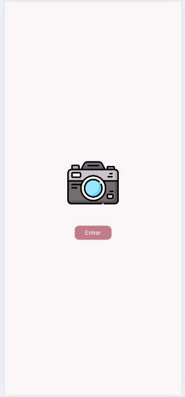
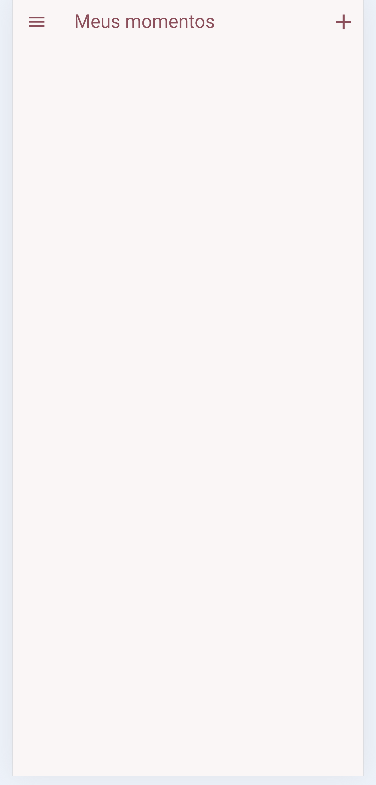
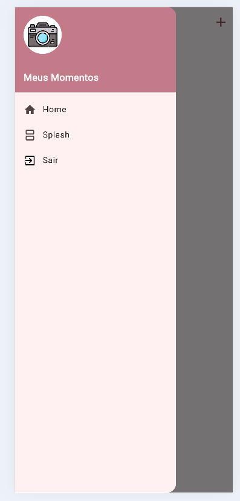
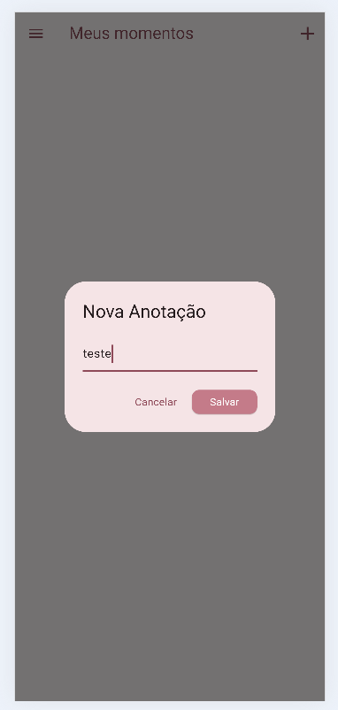
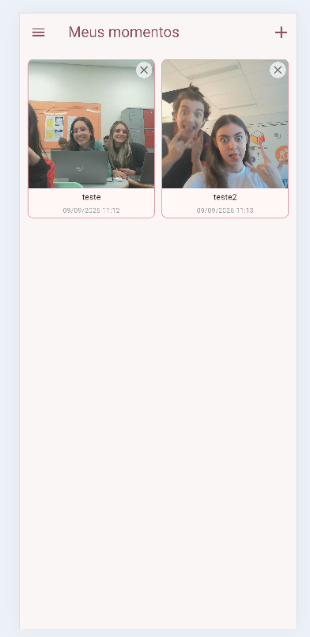
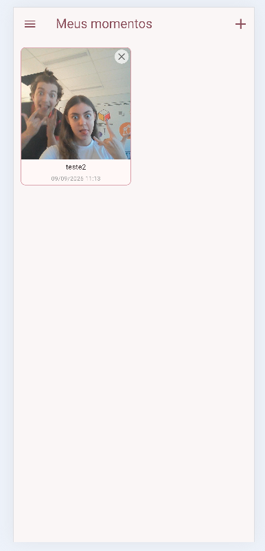

# Momentos (Flutter)

O **Meus Momentos** é um aplicativo mobile desenvolvido em Flutter que permite registrar momentos especiais tirando fotos pela câmera do dispositivo, adicionando anotações personalizadas e organizando tudo em um layout de grade (*grid*). O aplicativo conta com persistência local de dados, navegação simplificada e suporte a tema claro/escuro.

---

## Layout e Telas (Prints)

| 1. Tela Inicial | 2. Home Vazia | 3. Menu Lateral (Drawer) |
| :---: | :---: | :---: |
|  |  |  |

| 4. Modal para Anotação | 5. Home Com Fotos | 6. Exclusão |
| :---: | :---: | :---: |
|  |  |  |

---

## Funcionalidades

- **Tela de Apresentação (Splash)**: Animação inicial com ícone do aplicativo e botão de acesso direto.
- **Captura de Foto**: Integração nativa com a câmera do dispositivo (`image_picker`).
- **Anotações Personalizadas**: Modal interativo que solicita uma descrição antes de salvar a foto.
- **Armazenamento Local**: Persistência de dados das fotos e anotações via `shared_preferences` e cópia de arquivos no diretório do app (`path_provider`).
- **Visualização em Grid**: Organização das fotos em grade de 2 colunas com suporte a data e hora de registro.
- **Visualização Detalhada & Compartilhamento**: Tela de detalhes para ver a imagem expandida com botão de compartilhamento (`share_plus`).
- **Exclusão de Fotos**: Remoção de fotos direto do Grid ou pela tela de detalhes, apagando também o arquivo localmente.
- **Menu Lateral Simplificado**: Drawer minimalista contendo as opções de navegação **Home** e **Sair**.
- **Suporte Multiplataforma**: Tratamento de exceções e visualização dinâmica para Android, iOS e Web (`kIsWeb`).

---

## Tecnologias e Pacotes Utilizados

- **[Flutter](https://flutter.dev/)** (SDK v3.x+)
- **`image_picker`**: Acesso à câmera nativa e galeria.
- **`shared_preferences`**: Persistência local do histórico de momentos em formato JSON.
- **`path_provider`**: Gerenciamento de diretórios do sistema de arquivos local.
- **`intl`**: Formatação de data e hora (`dd/MM/yyyy HH:mm`).
- **`share_plus`**: Compartilhamento nativo de imagens e textos com outros apps.


---

## Como Executar o Projeto Localmente

### **Pré-requisitos**
- Flutter SDK instalado e adicionado às variáveis de ambiente (PATH).
- Editor recomendado: **VS Code** ou **Android Studio**.
- Dispositivo Android/iOS físico via USB com Depuração USB ativa ou Emulador/Simulador configurado.

### **Passos para Instalação:**

1. **Instalar todas as dependências:**
```bash
flutter pub get

```

2. **Executar a aplicação:**
```bash
flutter run

```


---

## Guia Completo de Testes

Siga os passos abaixo para testar todas as funcionalidades do aplicativo passo a passo:

### **1. Teste de Inicialização e Navegação (Splash & Menu)**

1. Inicie o aplicativo. A primeira tela exibida deve ser a **Splash Screen** com o ícone centralizado (`assets/icone.png`) e um botão **"Entrar"**.
2. Clique em **"Entrar"**. O app deve navegar para a **Home (Tela Principal)**.
3. Na **Home**, abra o menu lateral (Drawer) clicando no ícone do hambúrguer no canto superior esquerdo ou deslizando da esquerda para a direita.
4. Verifique se o menu exibe a imagem do ícone e apenas as opções **Home** e **Sair**.
5. Clique em **"Home"**: o menu deve se fechar e manter você na tela atual.
6. Abra o menu novamente e clique em **"Sair"**: você deve ser redirecionado de volta para a tela de **Splash**.

---

### **2. Teste de Captura de Foto e Anotação**

1. Na tela **Home**, clique no ícone de adicionar **`+`** (ou ícone da câmera) na barra superior (`AppBar`).
2. A câmera nativa do dispositivo será aberta:
* **No Celular/Emulador**: Tire uma foto e confirme a captura.
* **Na Web**: Escolha uma imagem do seu computador para simular.


3. Um **Modal (Diálogo)** surgirá solicitando uma anotação:
* Digite um texto (ex: *"Primeiro teste do app"*).
* Clicar em **"Cancelar"** fecha o modal sem salvar.
* Clicar em **"Salvar"** cria o novo card na grade.


4. Verifique se o card recém-criado exibe:
* A foto capturada.
* A anotação digitada.
* A data e hora atual no formato `DD/MM/AAAA HH:MM`.


---

### **3. Teste de Persistência Local (Salvar ao Fechar)**

1. Adicione pelo menos 2 momentos com fotos e anotações.
2. Feche o aplicativo completamente (encerre o processo da memória RAM no celular ou feche a aba no navegador).
3. Abra o aplicativo novamente e clique em **"Entrar"**.
4. **Resultado esperado**: Os momentos criados anteriormente devem continuar visíveis no Grid da Home.

---

### **4. Teste da Tela de Detalhes e Compartilhamento**

1. Na **Home**, toque sobre qualquer card de foto na grade.
2. A tela de **Detalhes** abrirá exibindo:
* A imagem em tamanho expandido.
* O texto completo da anotação.
* A data e hora da criação.


3. Clique no ícone de **Compartilhar** no canto superior direito:
* Deve abrir a caixa de diálogo nativa do sistema para compartilhar a imagem e o texto via WhatsApp, E-mail, etc.


---

### **5. Teste de Exclusão de Fotos**

Existem duas formas de excluir uma foto. Teste ambas:

* **Exclusão Rápida (Pelo Grid)**:
1. Na **Home**, clique no ícone de fechar **`X`** localizado no canto superior direito do card.
2. O card deve ser removido imediatamente da lista e o arquivo deletado do armazenamento local.


* **Exclusão pela Tela de Detalhes**:
1. Toque em um card para abrir os **Detalhes**.
2. Clique no ícone de **Lixeira** na barra superior.
3. O app deve fechar a tela de detalhes e remover a foto da Home.


---

## Estrutura de Pastas do Projeto

```text
lib/
├── models/
│   └── momento.dart          # Modelo de dados da foto, id, anotação e data
├── root/
│   └── file.dart             # Serviço de armazenamento local via SharedPreferences
├── style/
│   ├── colors.dart           # Cores do tema (Rosa Queimado)
│   └── theme.dart            # Configuração do ThemeData (Claro e Escuro)
├── ui/
│   ├── splash.dart           # Tela de Boas-Vindas (Splash Screen)
│   ├── home.dart             # Tela Principal com Grid e Drawer
│   └── detalhes.dart         # Tela de Visualização Expandida da Foto
└── main.dart                 # Ponto de entrada da aplicação

```
